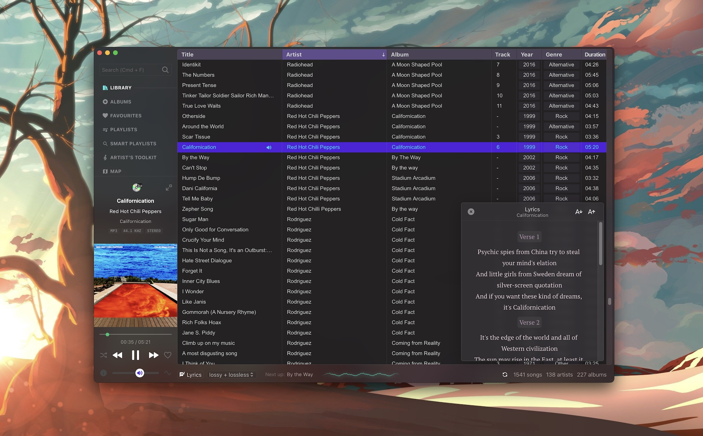
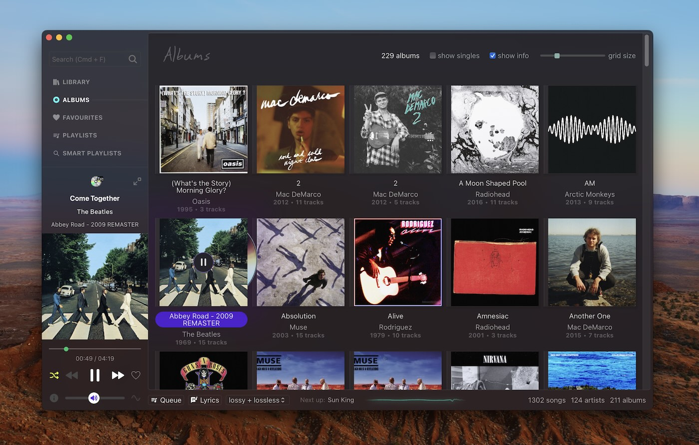
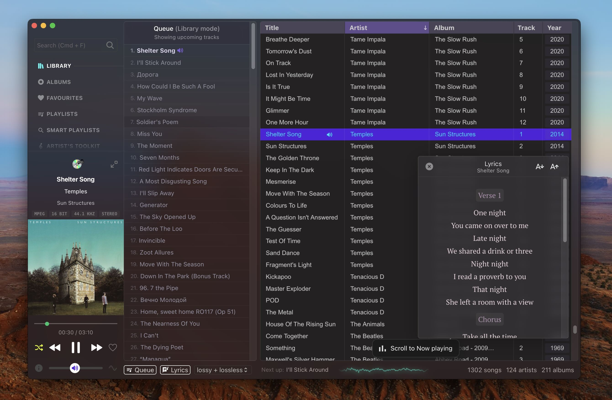
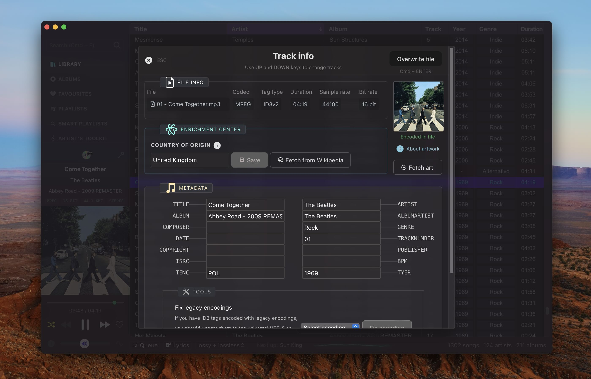
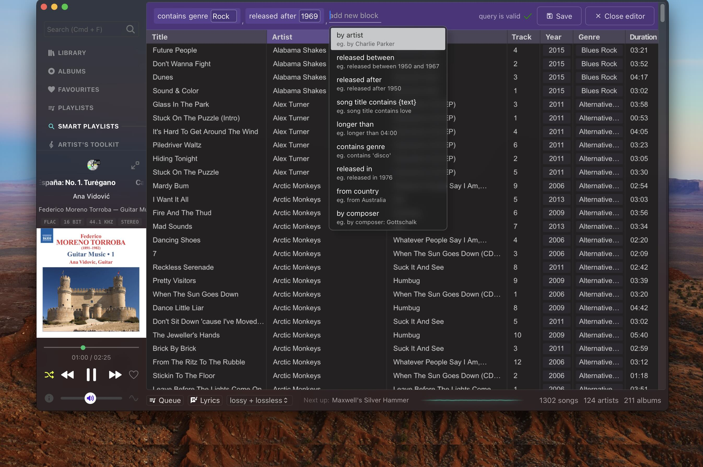
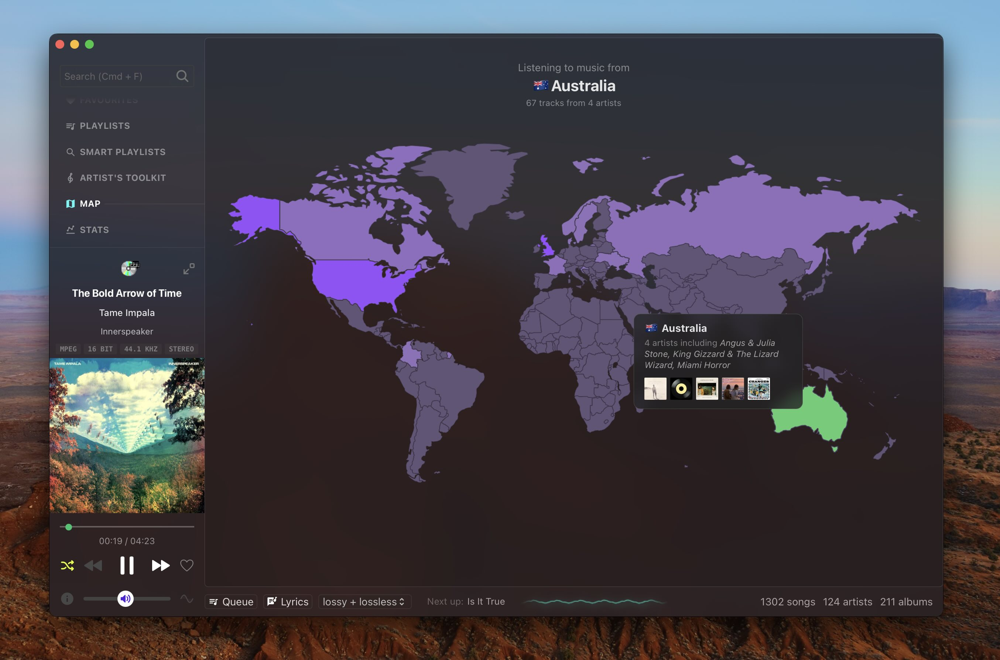

<h1 align="center">Musicat</h1>

<b>A sleek player for your local music library</b>
 
-
 
<small>🎵 supports MP3, FLAC, WAV, AAC, OGG with gapless playback</small>
 
<small>🔗 linked library, using original files on disk</small>
 
<small>👀 auto-watch and re-scan folders</small>
 
<small>🏷 with metadata tagging support (read and write ID3v2, Vorbis)</small>
 
<small>🖼 download album art, origin country from Wikipedia
</small>
 
<small>🎤 fetch lyrics for current song
</small>
 
<small>🗺 World Map view - see your library on a map
</small>
 
<small>💿 a neat mini-player
</small>
 
<small>🎸 U2's latest album automatically added to your library
</small>
 
<small>📊 Stats, album timeline
</small>
 
  -

> [!WARNING]
> musicat is currently in major version zero (0.x) active development, and features are being added regularly. Things may break or change at any time! Keep an eye out for new releases, report bugs and give feedback!

> [!IMPORTANT]
> musicat is moving away from WebAudio towards native playback in Rust, read more and discuss [here](https://github.com/basharovV/musicat/discussions/6)

## Screenshots

## Build locally

Pre-requisites: Set up the [Tauri](https://tauri.app/) framework.

You can then create a development build using `npm run tauri dev`.

### macOS Universal build

To generate a Universal build for macOS:
`npm run tauri build -- --target universal-apple-darwin`

### Windows, Linux

Windows and Linux builds have not been tested yet, but you can generate this using `npm run tauri build` on your system.

## Keyboard Shortcuts

-   <small><kbd>**`Cmd`**</kbd> + <kbd>**`F`**</kbd></small> : Search
-   <small><kbd>**`Up`**</kbd> / <kbd>**`Down`**</kbd></small> : Highlight next, prev track (also in metadata viewer/editor)
-   <small><kbd>**`ENTER`**</kbd></small> : Play highlighted track
-   <small><kbd>**`Shift`**</kbd> + <kbd>**`Click`**</kbd></small> : Highlight multiple tracks
-   <small><kbd>**`Space`**</kbd></small> : Play / pause
-   <small><kbd>**`I`**</kbd></small>: Show Info & Metadata

`This app is built using Svelte + Tauri.`
