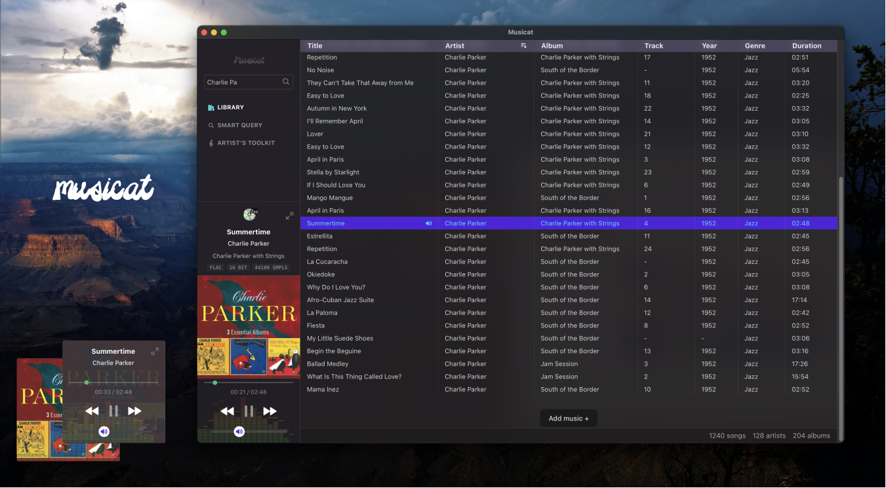
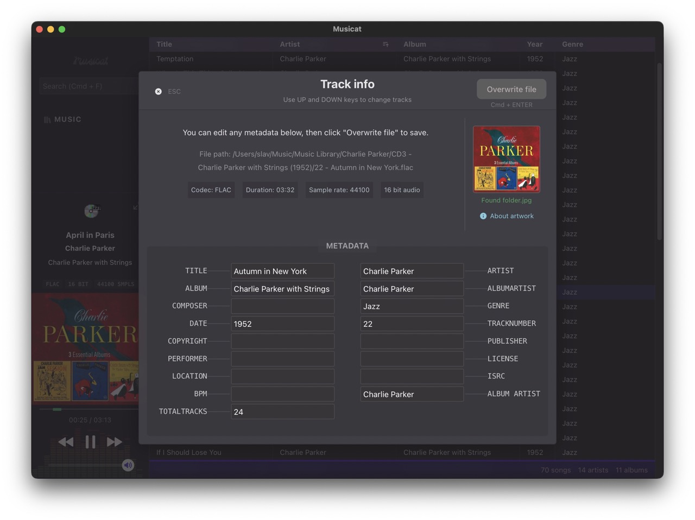
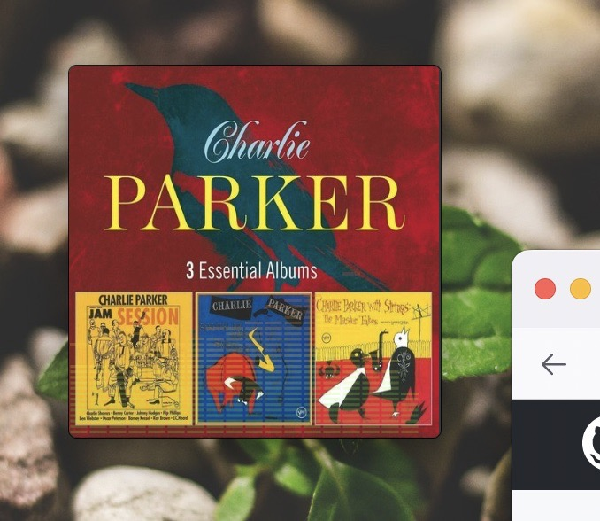
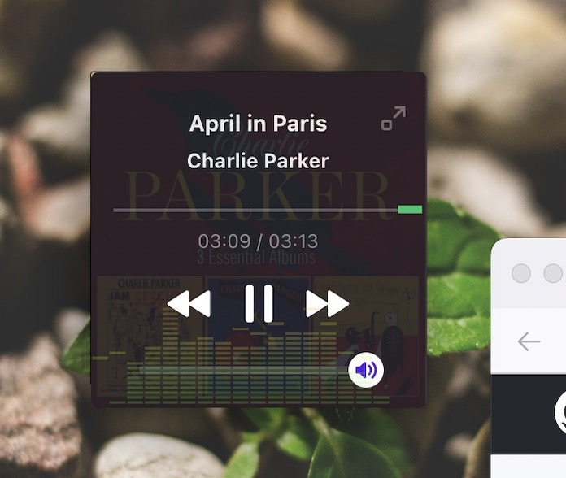

<h1 align="center">Musicat</h1>

<b>A sleek player for your local music library</b>
 
-
 
<small>🔗 linked music library, using original files on disk</small>
 
<small>🏷 with metadata tagging support (read and write ID3v2, Vorbis)</small>
 
<small>💿 a nice little mini-player
</small>
 
<small>🪕 Artist's toolkit for musicians
</small>
 
  -

Note: musicat is currently in major version zero (0.x) active development, and features are being added regularly. Things may break or change at any time! Keep an eye out for new releases, report bugs and give feedback! 

## Build locally
Pre-requisits: Set up the [Tauri](https://tauri.app/) framework.

You can then create a development build using `npm run tauri dev`. 
### macOS Universal build 
To generate a Universal build for macOS:
``npm run tauri build -- --target universal-apple-darwin`

### Windows, Linux
Windows and Linux builds have not been tested yet, but you can generate this using `npm run tauri build` on your system. 

## Features:
- File formats
  - [x] Supports MP3, FLAC, AAC, OGG, WAV
      - Metadata editing only for MP3 and FLAC
- Library
  - [x] Add track(s) and folders (also folders within folders)
  - [x] Delete track(s) with multi-select
  - [x] Look up tracks on YouTube / Wikipedia via right click
  - [x] Look up chords and lyrics on DuckDuckGo
  - [x] Basic search (matching by 'starts with' on title, album or artist)
  - [x] Advanced search (Smart queries)
- __Metadata / Track Info__
  

  - [x] Add or replace the track artwork
  - [x] View and Edit existing tags
  - [x] Add new tags (from common list), custom tags not supported yet
- __Mini-player__
  
  Small and widget-like. Window controls dissappear when in mini player mode.
  - [x] Save window position (four corners). Configurable in settings.

- Player
  - [x] Current track info and artwork (fallback to album folder artwork)
  - [x] Show format, bitrate, sample rate
  - [x] EQ visualizer
  - [x] Media keys support (also Space for play/pause)
  - [ ] Shuffle
  - [ ] Playlists
- UI
  - [ ] Custom themes

## Keyboard Shortcuts
- <small><kbd>**`Cmd`**</kbd> + <kbd>**`F`**</kbd></small> : Search
- <small><kbd>**`Up`**</kbd> / <kbd>**`Down`**</kbd></small> : Highlight next, prev track (also in metadata viewer/editor)
- <small><kbd>**`ENTER`**</kbd></small> : Play highlighted track 
- <small><kbd>**`Shift`**</kbd> + <kbd>**`Click`**</kbd></small> : Highlight multiple tracks
- <small><kbd>**`Space`**</kbd></small> : Play / pause
- <small><kbd>**`I`**</kbd></small>: Show Info & Metadata

`This app is built using Svelte + Tauri.`
