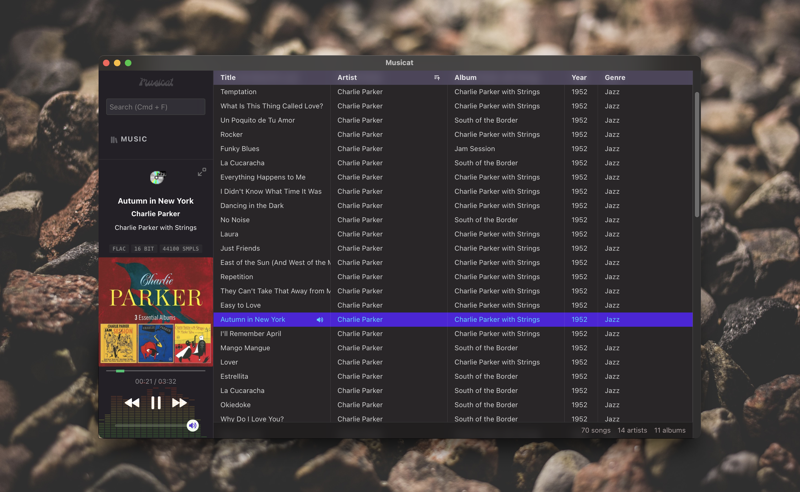
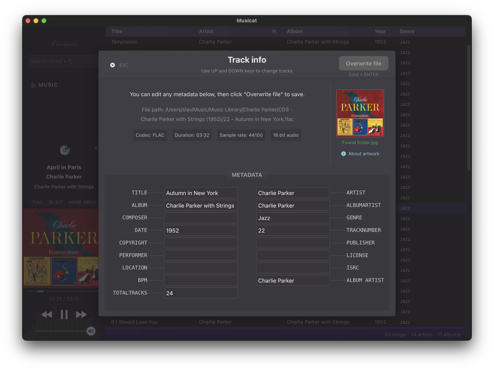
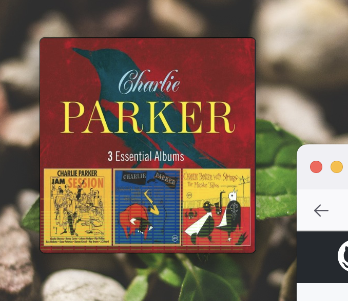
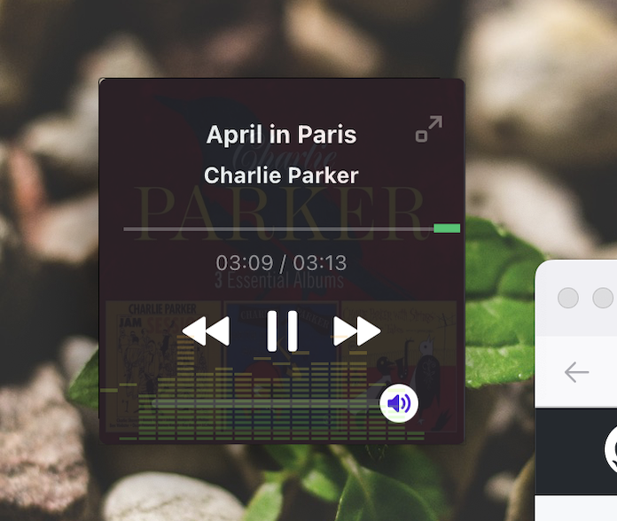

# Musicat

A sleek player for your local music library
 
--
 
<small>🔗 linked music library, using original files on disk</small>
 
<small>🏷 with metadata tagging support (read and write ID3v2, Vorbis)</small>
 
<small>💿 a nice little mini-player
</small>

----

## Features:
----
- File formats
  - [x] Supports MP3, FLAC, AAC, OGG, WAV
      - Metadata editing only for MP3 and FLAC
- Library
  - [x] Add track(s) and folders (also folders within folders)
  - [x] Delete track(s) with multi-select
  - [x] Look up tracks on YouTube / Wikipedia via right click
  - [x] Look up chords and lyrics on DuckDuckGo
  - [x] Basic search (matching by 'starts with' on title, album or artist)
  - [ ] Advanced search
- Metadata / Track Info
  

  - [x] Add or replace the track artwork
  - [x] View and Edit existing tags
  - [x] Add new tags (see [here]() for list of supported tags)
- Mini-player 
  
  Small and widget-like. Window controls dissappear when in mini player mode.
  - [ ] Save window position

- Player
  - [x] Current track info and artwork (fallback to album folder artwork)
  - [x] Show format, bitrate, sample rate
  - [x] EQ visualizer
  - [x] Media keys support (also Space for play/pause)
  - [ ] Shuffle
  - [ ] Playlists
- UI
  - [ ] Custom themes

## Keyboard Shortcuts
- <small><kbd>**`Cmd`**</kbd> + <kbd>**`F`**</kbd></small> : Search
- <small><kbd>**`Up`**</kbd> / <kbd>**`Down`**</kbd></small> : Highlight next, prev track (also in metadata viewer/editor)
- <small><kbd>**`ENTER`**</kbd></small> : Play highlighted track 
- <small><kbd>**`Shift`**</kbd> + <kbd>**`Click`**</kbd></small> : Highlight multiple tracks
- <small><kbd>**`Space`**</kbd></small> : Play / pause
- <small><kbd>**`I`**</kbd></small>: Show Info & Metadata

`This app is built using Svelte + Tauri.`