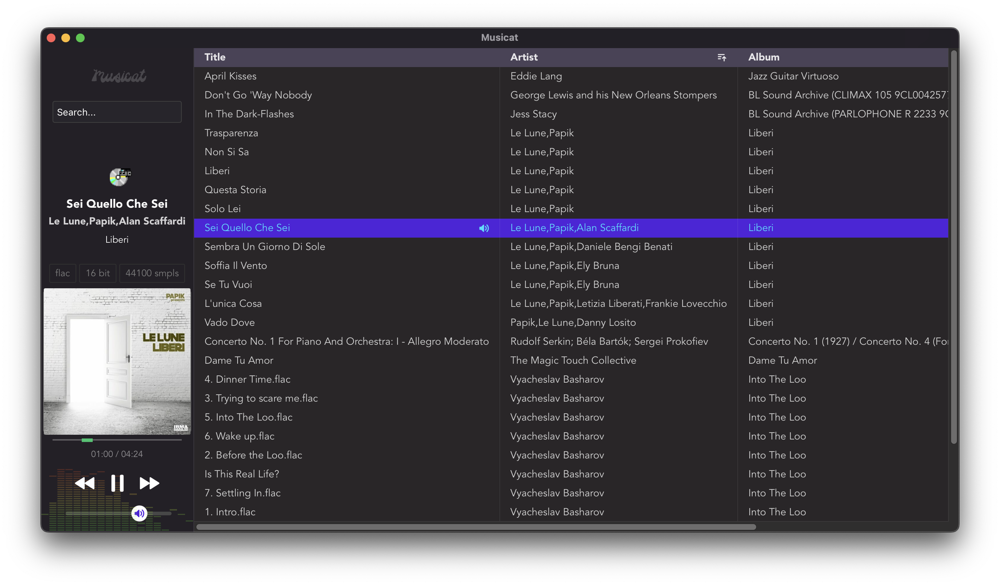

# Musicat
A sleek music player app for your local library

Features:
- Import
  - [x] Supports MP3, FLAC, AAC, OGG, WAV
  - [x] Basic info from ID3 tags (title, artist, album, genre, year)
  - [ ] Advanced metadata from ID3 tags
  - [x] Recursive folder import
  - [x] Import via song/folder drag and drop 
- Library
  - [x] Basic table with sorting by indexed fields
  - [x] Delete track
  - [ ] Delete in bulk
  - [x] Look up tracks on YouTube / Wikipedia via right click
  - [x] Look up chords and lyrics on DuckDuckGo
  - [x] Basic search (matching by 'starts with' on title, album or artist)
  - [ ] Advanced search
- Player
  - [x] Current track info and artwork
  - [x] Show format, bitrate, sample rate
  - [x] Seekbar
  - [x] EQ visualizer
  - [x] Media keys support (also Space for play/pause)
  - [ ] Shuffle

This app is built using Svelte + Tauri.